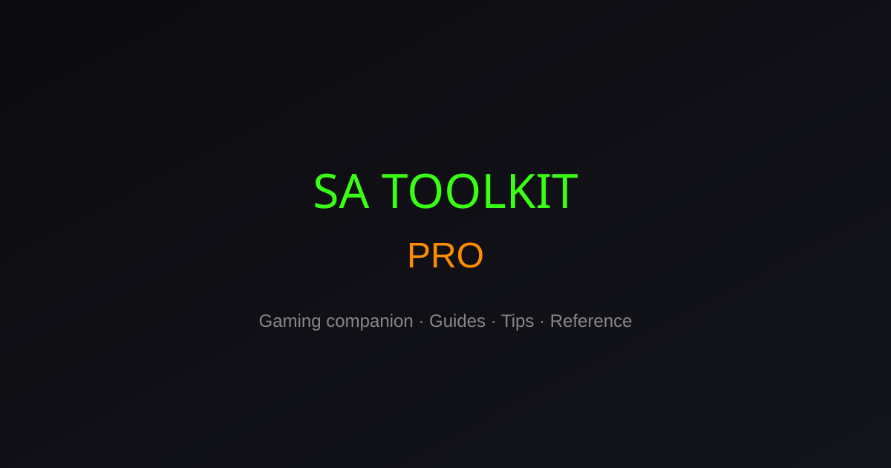

# GTA SA Toolkit

An independent companion toolkit for GTA SA on Android — cheat codes, device compatibility checking, installation guides, and version comparison tools.

## Live Demo
https://gta-sa-toolkit.vercel.app

## Official Website

[GTASanad.org](https://gtasanad.org)

## GTA Resources

- [GTA SA APK Guide](https://gtasanad.org)
- [GTA Cheat Codes](https://gtasanad.org/gta-san-andreas-cheat-codes-android/)
- [GTA Vice City APK](https://gtasanad.org/gta-vice-city-mod-apk-1-12-259/)
- [GTA Toolkit Pro](https://gtasanad.org/gta-toolkit-pro/)

A production-ready companion web app and Android shell for GTA SA players. Built with Next.js 15, React, TypeScript, Tailwind CSS, and Framer Motion.



## Features

- **Cheat Code Finder** — Search, filter by category, one-click copy, toast notifications
- **Android Installation Wizard** — Step-by-step APK + OBB guide with FAQ
- **Device Compatibility Checker** — RAM, storage, and Android version scoring
- **Save Game Library** — Browse save categories with modern cards
- **Version Comparison** — GTA SA 2.11.311 vs 2.11.277 vs Vice City
- **Mission Guide** — 27+ missions with walkthroughs and tips
- **Troubleshooting Center** — Black screen, OBB, crashes, lag fixes
- **Favorites** — Save cheats and guides (localStorage)
- **Analytics Dashboard** — Local usage stats (views, copies, categories)
- **Blog** — SEO-friendly articles with internal linking
- **i18n** — English and Arabic with full RTL support
- **SEO** — Metadata, Open Graph, JSON-LD schemas, sitemap, robots.txt

## Tech Stack

| Technology | Purpose |
|------------|---------|
| Next.js 15 | App Router, SSR, static generation |
| React 19 | UI |
| TypeScript | Type safety |
| Tailwind CSS | Styling |
| Framer Motion | Animations |
| next-intl | Internationalization |
| sonner | Toast notifications |
| localStorage | Favorites & analytics persistence |
| Capacitor 8 | Native Android shell |

## Prerequisites

- Node.js 20+
- npm, yarn, or pnpm

## Getting Started

```bash
# Install dependencies
npm install

# Copy environment variables
cp .env.example .env.local

# Start development server
npm run dev
```

Open [http://localhost:3000](http://localhost:3000) — you'll be redirected to `/en`.

## Environment Variables

| Variable | Description | Default |
|----------|-------------|---------|
| `NEXT_PUBLIC_SITE_URL` | Canonical URL for SEO/sitemap | `http://localhost:3000` |

## Scripts

```bash
npm run dev              # Development with Turbopack
npm run build            # Production web build (Vercel)
npm run start            # Start production server
npm run lint             # ESLint

# Android (Capacitor)
npm run build:android    # Static export + sync Android project
npm run cap:assets       # Regenerate app icon & splash screen
npm run cap:open:android # Open project in Android Studio
npm run android:keystore # Create release signing keystore (requires JDK)
npm run android:bundle   # Build signed release AAB for Google Play
```

## Android App (Capacitor)

The web app ships as a native Android app via [Capacitor 8](https://capacitorjs.com/). All toolkit features (cheats, missions, favorites, analytics, EN/AR) are bundled offline as static pages.

| Requirement | Value |
|-------------|-------|
| Min Android | 10 (API 29) |
| App ID | `org.gtasanad.toolkit` |
| Web bundle | `out/` (Next.js static export) |

### Prerequisites

- [Android Studio](https://developer.android.com/studio) (Ladybug or newer)
- JDK 17+ (`JAVA_HOME` set — Android Studio includes one)
- Node.js 20+

### Build the Android project

```bash
# 1. Export web app and sync Capacitor
npm run build:android

# 2. Generate launcher icon & splash (first time or after changing assets/icon.png)
npm run cap:assets

# 3. Open in Android Studio
npm run cap:open:android
```

Run on a device/emulator from Android Studio, or build a debug APK:

```bash
cd android
./gradlew assembleDebug   # Windows: gradlew.bat assembleDebug
```

### Signed AAB for Google Play

1. **Create a keystore** (once):

```bash
npm run android:keystore
```

This creates `release.keystore` in the project root. Change the default password (`changeit`) before publishing.

2. **Configure signing**:

```bash
cp android-keystore.properties.example android/keystore.properties
```

Edit `android/keystore.properties` with your keystore passwords.

3. **Build the release bundle**:

```bash
npm run android:bundle
```

The signed AAB is output at:

```
android/app/build/outputs/bundle/release/app-release.aab
```

Upload this file to [Google Play Console](https://play.google.com/console).

> **Note:** `release.keystore`, `android/keystore.properties`, and `android/local.properties` are gitignored. Back up your keystore — Google Play requires the same key for all updates.

### Updating the app

After web changes:

```bash
npm run build:android
npm run android:bundle
```

Increment `versionCode` and `versionName` in `android/app/build.gradle` before each Play Store release.

## Project Structure

```
src/
├── app/[locale]/     # Localized routes (en, ar)
├── components/       # UI and feature components
├── data/             # Mock content (cheats, missions, blog, etc.)
├── hooks/            # Custom React hooks
├── i18n/             # next-intl routing config
├── lib/              # Utilities (compatibility, analytics, metadata)
├── providers/        # React context providers
└── types/            # TypeScript interfaces
messages/             # en.json, ar.json translations
public/               # Static assets
assets/               # Capacitor icon & splash source images
android/              # Android Studio project (Capacitor)
capacitor.config.ts   # Capacitor app configuration
scripts/              # Android build & signing helpers
```

## Deployment

### Vercel (Recommended)

1. Push the repository to GitHub
2. Import the project on [vercel.com](https://vercel.com)
3. Set `NEXT_PUBLIC_SITE_URL` to your production domain (e.g. `https://gtatoolkit.vercel.app`)
4. Deploy

### Other Platforms

Build the app and run the Node server:

```bash
npm run build
npm run start
```

Set `NEXT_PUBLIC_SITE_URL` to your production URL before building so sitemap and canonical URLs are correct.

## Adding Translations

Edit `messages/en.json` and `messages/ar.json`. Keys are grouped by feature namespace (`cheats`, `missions`, etc.). Use `useTranslations("namespace")` in client components or `getTranslations` in server components.

## Disclaimer

This is an **independent fan-made companion** and is not affiliated with, endorsed by, or associated with Rockstar Games or Take-Two Interactive.

## License

MIT — See repository for details. Use responsibly and support official game purchases where available.
